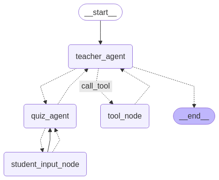

# Smart Driving School Project PoC




This project is a PoC of driving school instructor. the vision behind this project is to use the power of ai agents in helping students ask thier quesitons and also practice for exams. 

this repo was forked from "https://github.com/Azure-Samples/python-ai-agent-frameworks-demos", and it holds alot of files to help get started with ai agents and work with azure. but the contribution for the hacatho is the folder `smart_driving_school/src`.

## main scripts in`smart_driving_school/src`

1. `smart_driving_school/src/azure_ai_search.py`script connects to the azure ai search service and fetches for giving query the relevent docs from the index
2. `smart_driving_school/src/creating_index.py` this script creates an index similaire to the one created for this project. for the project the service and the index was created from the portal
3. `smart_driving_school/src/data_uplaoding_az_blob.py` script pushes the used documents to blob storage
4. `smart_driving_school/src/ds_agents.py` script holds the definition and the logic of each driving school agent. teacher_agent, quiz_agent, student_input_node (to get the user responses)

## 📺 Demo Video

[▶️ Watch the demo video on Google Drive]([https://drive.google.com/file/d/YOUR_FILE_ID/view?usp=sharing](https://drive.google.com/file/d/1mcBiO2WCoheVH5pKHome6_X_DXXPQXRy/view?usp=sharing))

## Getting Started


1. Create a `.env` file.

```bash
cp .env.example .env
```

2. Define required API keys in your `.env` file. and make sure to position on the src file in the powershell
3. run `python data_uplaoding_az_blob.py` to upload driving lessons pdfs to the azure container
4. run `python creating_index.py` to create the index, you might need adjustement in azure portal.
5. test by executing query search in `smart_driving_school/src/azure_ai_search.py` if there is response then everything is set.

## Solution 

1. **agents prompts**: each agent has prompt in the file:  [prompts.py](./smart_driving_school/src/prompts.py).
2. **Select a different model**: We default to gbt-4 from github. [model.py](./smart_driving_school/src/model.py) while working i been changing between gbt-4o-mini and gbt-4o. this because they both free and easy to load using the settings set by the original repo.
3. **graph**: The core logic of the chatbot is defined in [graph.py](/smart_driving_school/src/graph.py). you can interact from terminal with the graph after running the file. you will have Q/A interaction with the agents.

## 📚 Data Source

The learning material and practice questions were sourced from public resources provided by the **New South Wales (NSW) Driver Knowledge Test (DKT)**.  
Special thanks to **NSW DKT** for making this content publicly available — it served as the foundation for the document search and AI-driven responses in this PoC.

